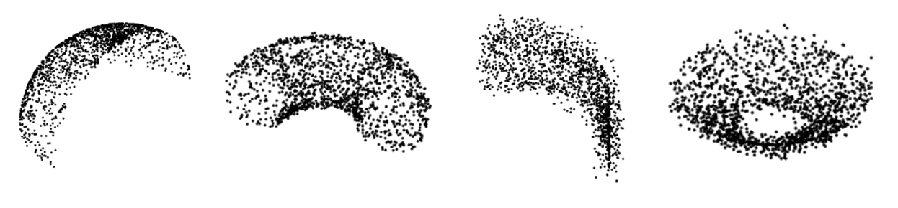

# SHREC 2022: Fitting and recognition of simple geometric primitives on point clouds

### This is the solution ranked 3rd and published in Computer & Graphics (Elsevier) - Q2 Journal


The aim of this SHREC track is to evaluate the quality of automatic algorithms for fitting and recognising geometric primitives in point clouds. The goal is to identify, for each point cloud, its primitive type and some geometric descriptors. As simple primitives we mean the classical surface primitives derived from constructive solid geometry, i.e., planes, spheres, cylinders, cones and tori. We admit that some point clouds might be unfitted by one of these simple primitives.

## Table of Content
- Requirements
- Dataset
- Data preprocessing
- Classify
- Trainning
- Evaluation

## Requirements
- python=3.7
- torch==1.8.0
```sh
conda create -n shrec 
conda activate shrec
pip install torch==1.8.0+cu111 torchvision==0.9.0+cu111 torchaudio==0.8.0 -f https://download.pytorch.org/whl/torch_stable.html
pip install open3d
```

## Dataset
Data is provided by SHREC2022. To get the the full dataset please contact them 
through this [website](http://shrec.ge.imati.cnr.it/shrec22_fitting/)
```
dataset
└───train
	|Cone
	|Cylinder
	|Plane
	|Shpere
	|Torus
───val
	|val_txt
	|val_ply
───test
	|testdata
```

## Data preprocessing
Given the raw data, we need to upscale the pointclouds data to a constant value. To do that, we can run the following code
```sh
python preprocessing.py
```
We provided a code to change .txt file to .ply if needed
```sh
python txt2ply.py
```

## Classify
Fitting the pointclouds and store the data in a csv file
```sh
python classify.py
```

## Training
For training, we employed pointNet architecture. Pretrained models are save in the model/ directory. 
```sh
python train.py 
``` 

## Evaluation 
```sh
python eval.py 
``` 


